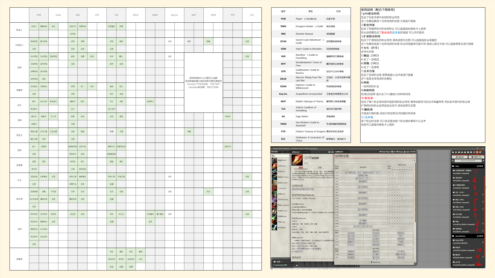

# DnD 5e classpack zh-tw 正體中文  for fvtt

本模組是[DND5e classpack for fvtt](https://github.com/HJSmile/classpack) 的正體中文化

## 簡介

整合了大部分種族，職業，物品，法術，同時可以使dm完全關閉babele換取載入效能。
該mod與babele相容性很差，請自行決定是否開啟babele。

## 使用方法

打開安裝MOD界面，複製以下路徑

```
https://raw.githubusercontent.com/hktrpg/fvtt-5e-classpack-zh-tw/master/dnd5e_classpack/module.json
```


貼上至以下位置后，點選安裝

## 介紹



## 由簡體中文轉換成正體中文的方式

本模組使用 [The official Foundry VTT CLI](https://github.com/foundryvtt/foundryvtt-cli) 與 [ConvertZZ](https://github.com/flier268/ConvertZZ) 進行轉換

1. 使用foundryvtt-cli 把ldb 轉成json
2. 使用ConvertZZ 進行繁簡轉換
3. 使用foundryvtt-cli 把json 轉成ldb

## 更新日誌

### 2023.8.19 (v2.2.6)

加入了大量拓展魔法物品,截至塔莎書(TCE) 所有魔法物品更新完畢加入了github workflow自動壓縮.zip 壓縮(←我給我自己省事兒)修復了部分已知bug (例如獲得魔寵更正為儀式法術)引入了更多的未知bug
部分魔法物品並未給每個變體建立物品。望使用者自行修改。(或者是後續維護者自行修改)(相信後人智慧)例:

+ 熔銅面板(胸甲、半身板甲或板甲) 僅建立了板甲；
+ 冥河之劍 Acheron blade 僅建立了長劍；

部分丟失的隨機表源於
[DMTools](https://github.com/feederze/DMTools) ← 我在同時更新兩個模組的時候忘了這碼事 把有些東西弄混了 乾脆推一波

### 更新日誌2023.6.11（v2.2.0）

-修復了fvtt 11不能識別classpack包的問題

BUG修復

-吟遊詩人法表多出法術無效結界
-各個職業特性中的法表關聯丟失
-漿人缺失語言特性
-傳送術表格缺失
-特性中的熟練加值的程式碼修復為@prof
-艾羅娜的箭袋 Quiver of Ehlonna稀有度錯誤
-梟人種族特性中的前置條件未更改
-成年銀龍的英文名稱
-種族描述的許可權錯誤
-修改了一些錯別字與拼寫錯誤的單詞
-原始意志與自然面紗的來源從PHB改為TCE
-從法術列表中刪除古賢之誓
-法術「探知」的格式
-人工智慧生命體的怪物丟失
-更正鍊甲衫與鑲釘皮甲的稀有度為空
-FTD子職的升級鏈接丟失

更新內容

-更新了一些表格格式
-文件中的SAS（Spelljammer: Adventures in Space）縮寫均改為AAG（Astral -Adventurer's Guide）
-跟隨DND5e 2.2.0系統更新怪物token，主要是幾條成年龍
-去除專長合集的「（補全）」二字
-給職業中的快速建卡新增了物品鏈接，現在可以更快速的建卡了
-魔契的特性型別新增為魔契恩澤
-將法師20級的獨門法術1和獨門法術2合併爲一個
-更新了奇械師注法的邏輯，將注法的物品和注法的特性分離；更新了TCE的三個注法
-新增了XGE的物品

### 更新日誌22.10.3（v2.0.0）

-優化職業表、法術表、種族的格式以適應新版本
-跟隨DND5e系統更新怪物token
-修復一些bug

-大概率無法向下相容

### 更新日誌2022.7.15

-修正了吟遊詩人雄辯學院統一言說特性的掌握等級
-修正了戰鬥風格：雙武器戰鬥
-新增FTD相關內容：
子職：龍獸守衛&神龍宗
種族：各種龍裔
龍類專長
巨龍魔法
-其它新增內容：
SCC法表
種族梟人
TCE專長
