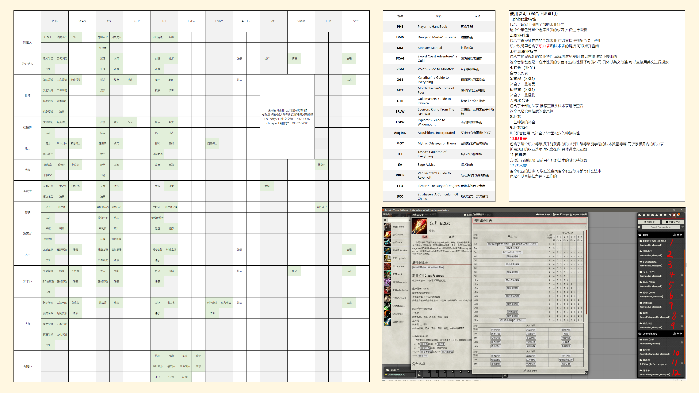

# DnD 5e classpack zh-tw 正體中文  for fvtt


本模組是[DND5e classpack for fvtt](https://github.com/HJSmile/classpack) 的正體中文化

## 簡介

整合了大部分種族，職業，物品，法術，同時可以使dm完全關閉babele換取載入效能。
該mod與babele相容性很差，請自行決定是否開啟babele。

## 安裝方法

打開安裝MOD界面，複製以下路徑

```
https://raw.githubusercontent.com/hktrpg/fvtt-5e-classpack-zh-tw/master/dnd5e_classpack/module.json
```

## 相關模組

DnD 5e classpack zh-tw 正體中文 for fvtt

<https://raw.githubusercontent.com/hktrpg/fvtt-5e-classpack-zh-tw/master/dnd5e_classpack/module.json>

龍與地下城五版（DnD5E）—正體中文
<https://gitlab.com/fvtt-zh_TW/dnd5e-taiwan-zh-tw/-/raw/main/module.json>

Translation: 正體中文 [DnD 5e]
<https://raw.githubusercontent.com/HKTRPG/foundryVtt_dnd5e_zh-tw/main/module.json>

Actor Studio
<https://github.com/geoidesic/foundryvtt-actor-studio/releases/latest/download/module.json>

Translation: 正體中文 [Core]
<https://raw.githubusercontent.com/hktrpg/foundry_zh-tw/main/module.json>

DND5E城主工具包-正體中文
<https://raw.githubusercontent.com/hktrpg/fvtt-5e-DMTools-zh-tw/main/module.json>

## 使用方法

<https://docs.google.com/document/d/1G4umHkFeSWn0ma92kaL_EI0lVRMhfk9ZKVjfLI2PXMY/edit#heading=h.gt8p42yhd29y>

## 介紹



## 轉換方法

如果未來你有其他 Package 想翻譯或修改，可參考以下方法。

本模組使用 [Foundry VTT CLI](https://github.com/foundryvtt/foundryvtt-cli) 與 [ConvertZZ](https://github.com/zouhuidong/ConvertZZ) 進行轉換：

1. 使用 foundryvtt-cli 把 ldb 轉成 json
2. 使用 ConvertZZ 進行繁簡轉換
3. 使用 foundryvtt-cli 把 json 轉成 ldb

### 前置設定

```powershell
cd YOUR_PATH_TO/foundrydata/Data/modules/classpack

fvtt configure set dataPath "XXXXXX\FoundryVTT\Data"
```

> 若為本專案正體中文版，路徑改為 `dnd5e_classpack-zh-tw`，`--id` 改為 `dnd5e_classpack-zh-tw`。

### 批次解包（unpack）

將 `packs` 下所有 LevelDB 合集包解壓至 `src/packs/`：

```powershell
# 1. 獲取 packs 資料夾下所有的子資料夾名稱
$packs = Get-ChildItem ./packs | Where-Object { $_.PSIsContainer } | Select-Object -ExpandProperty Name

# 2. 迴圈執行 unpack 指令，補上明確的 ID 與 Type
foreach ($pack in $packs) {
    Write-Host "正在解壓資料庫: $pack ..." -ForegroundColor Cyan
    fvtt package unpack $pack --id "dnd5e_classpack-zh-tw" --type "Module" --out "./src/packs/$pack"
}

Write-Host "所有資料庫已成功解壓至 src/packs/ 目錄！" -ForegroundColor Green
```

### 批次打包（pack）

將 `src/packs/` 下翻譯後的 JSON 打包回 LevelDB：

```powershell
# 1. 獲取翻譯好的資料夾名稱
$srcPacks = Get-ChildItem ./src/packs | Where-Object { $_.PSIsContainer } | Select-Object -ExpandProperty Name

# 2. 開始打包
foreach ($pack in $srcPacks) {
    Write-Host "正在打包資料庫: $pack ..." -ForegroundColor Yellow
    
    $inputDir = "./src/packs/$pack"
    fvtt package pack -n "$pack" --id "dnd5e_classpack-zh-tw" --type "Module" --in "$inputDir"
}

Write-Host "加壓完成！請檢查 packs 資料夾結構。" -ForegroundColor Green
```

## 更新日誌

> 完整更新紀錄請見 [CHANGELOG.md](./dnd5e_classpack-zh-tw/CHANGELOG.md)。

### 2026/03/18

本專案基於 [HJSmile/classpack](https://github.com/HJSmile/classpack) 簡體中文4.3.4版，使用 [ConvertZZ](https://github.com/zouhuidong/ConvertZZ) 進行正體中文轉換。README 新增 Foundry VTT CLI 批次 unpack / pack 說明。

### v4.3.4（2025/09/17）— 最新版

- 移除物品消耗次數、恢復武器與護甲自動熟練
- 職業升級可選擇子職
- 法術表檢查與修復（儀式標記、學派標記）
- 升級自動加入法術（德魯伊、牧師、聖武士、奇械師）
- 游俠宿敵／夙敵、熟練探險家修復
- 4.X 行動組合修復（法術、職業特性）
- 種族、專長、子職補全；warlock 統一譯為魔契師

### v4.3.3（2025/09/08）

- 新增技能圖示與怪物 token
- 更新 module.json 與合集包 manifest

### v4.3.2（2025/08/14）

- 一般更新與修復

### v4.3.1（2025/08/10）

- 車卡相關重大改動：職業、子職、專長、物品、背景自動化配置
- 新增野蠻人巨人道途、武僧神龍宗
- 新增 BPGG、BMT 資料；推薦 Midi QOL

### v4.0.2（2025/04/08）

- 套用官方遷移器 4.x 升級
- 移除錯誤物品使用次數
- 大部分物品使用次數自動化（休息恢復、物品充能）
